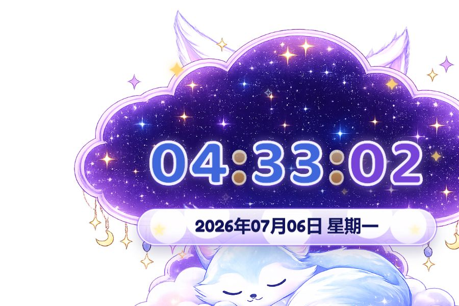

# Clock Widget Qiu

一个可自定义的直播数字时钟挂件，适合放进 OBS、直播姬、VTube Studio 等直播工具里作为浏览器源使用。

## 项目介绍（它解决什么问题）

直播时经常需要一个好看的时间挂件，但常见方案要么太普通，要么不能透明叠加，要么改样式很麻烦。

Clock Widget Qiu 解决的是这几个小问题：

- 想要一个透明背景的直播时钟，可以直接叠在画面上。
- 想要不用安装软件，打开 HTML 就能用。
- 想要能自己改时间格式、日期显示、字体和图片素材。
- 想要一个可爱的主题模板，后续可以继续换成自己的风格。

这个项目是纯前端实现：`HTML + CSS + JavaScript`。没有后端，不需要构建工具，也不依赖 CDN，下载后可以离线运行。

## 截图 / GIF 演示

当前效果预览：



默认推荐浏览器源尺寸：

```text
900 x 600
```

## 安装方式

方式一：直接下载 ZIP。

1. 打开 GitHub 项目页。
2. 点击 `Code`。
3. 选择 `Download ZIP`。
4. 解压后保留整个文件夹。
5. 使用 `index.html` 作为浏览器源。

方式二：使用 Git。

```bash
git clone https://github.com/somali0128/clock-widget-qiu.git
cd clock-widget-qiu
```

本地预览：

```text
双击 index.html
```

直播软件导入：

```text
添加浏览器源 -> 选择本地文件 -> 选择 index.html -> 尺寸 900 x 600
```

更适合新手的详细步骤见：

```text
使用说明.txt
```

## 使用示例

主要配置文件是：

```text
setting.json
```

默认配置：

```json
{
  "time": {
    "showHour": true,
    "showMinute": true,
    "showSecond": false,
    "separator": ":"
  },
  "date": {
    "showDate": true,
    "showYear": false,
    "showMonth": true,
    "showDay": true,
    "showWeekday": true,
    "weekdayStyle": "short",
    "separator": "，"
  }
}
```

显示秒：

```json
"showSecond": true
```

隐藏日期：

```json
"showDate": false
```

隐藏周几：

```json
"showWeekday": false
```

把“周一”改成“星期一”：

```json
"weekdayStyle": "long"
```

改完后刷新浏览器源即可生效。

## 自定义素材

图片素材在：

```text
assets/images/
```

当前主要素材：

- `background (2).png`：背景和边框。
- `fox_front.png`：右下角小狐狸。
- `ear_left.png` / `ear_right.png`：耳朵素材，目前隐藏但保留。

推荐素材尺寸：

```text
1536 x 1024
```

如果只是换同尺寸图片，通常不需要大改代码。

## 自定义字体

字体文件在：

```text
assets/fonts/
```

当前数字字体：

```text
HollyBerryPop-PVxdZ.otf
```

如果要换字体，主要修改：

```text
css/style.css
```

找到 `@font-face` 和 `.time` 的 `font-family` 即可。

## Roadmap

- 支持更多预设主题。
- 增加可视化设置面板，不用手动编辑 `setting.json`。
- 增加 12 小时制 / 24 小时制切换。
- 增加多套日期格式。
- 增加更多动画强度选项。
- 增加移动端尺寸预设。
- 增加更多字体搭配示例。

## FAQ

### 这个挂件需要联网吗？

不需要。下载完整项目后可以离线运行。

### 为什么我双击 `index.html` 后设置没变化？

部分浏览器直接打开本地文件时，对 `setting.json` 的读取会有限制。直播软件的浏览器源通常可以正常读取。若你本地预览异常，可以用简单静态服务器打开，或直接在直播软件里测试。

### 为什么直播里有黑底或白底？

页面本身是透明背景。如果出现底色，通常是直播软件的浏览器源背景设置造成的。检查是否开启了背景填充，或把背景色设为透明。

### 能不能只发 `index.html` 给别人？

不建议。图片、字体、脚本和设置文件都在其他文件夹里。请把整个项目文件夹一起打包。

### 可以换成自己的主题吗？

可以。这个项目的思路就是“图片素材负责风格，HTML 文本负责实时数字”。你可以替换背景、小狐狸、字体和颜色，做成自己的直播时钟。

### GitHub README 里的 Buy Me a Coffee 按钮为什么不是脚本按钮？

GitHub README 不会执行 `<script>`，所以这里放的是可点击链接。如果你要把按钮放到自己网页里，可以使用下面的脚本代码。

## ⭐ 如果喜欢，请 Star

如果这个项目对你的直播间、素材制作或前端小挂件有帮助，欢迎给项目点一个 Star。

你的 Star 会让我知道这个小工具真的有人在用，也会更有动力继续做主题和功能。

## ☕ Buy Me a Coffee

如果你想支持一下，可以请我喝杯咖啡：

[Buy me a coffee](https://www.buymeacoffee.com/somayue)

如果你要把 Buy Me a Coffee 按钮放进自己的网页，可以使用这段代码：

```html
<script type="text/javascript" src="https://cdnjs.buymeacoffee.com/1.0.0/button.prod.min.js" data-name="bmc-button" data-slug="somayue" data-color="#FFDD00" data-emoji=""  data-font="Comic" data-text="Buy me a coffee" data-outline-color="#000000" data-font-color="#000000" data-coffee-color="#ffffff" ></script>
```

## License

代码部分可以作为直播数字时钟挂件模板继续修改和二次创作。

图片素材和 `HollyBerryPop-PVxdZ.otf` 字体来自用户提供，请按照你获取素材时的授权范围使用。

`Baloo 2` 和 `Fredoka` 来自 Google Fonts，授权为 SIL Open Font License 1.1。
